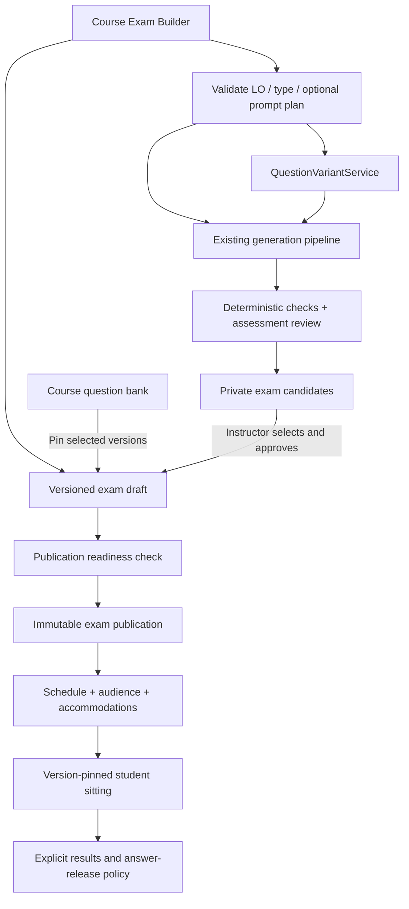

# Exam Builder v2 — design for review

Date: 2026-09-26 · Stephen · Status: design proposal, not implemented

Prototype: `index.html` (open in a browser; all questions and AI output are local sample data). Existing application code and the earlier TA work are untouched by this design.

## Product decision

Replace the count-based Exam Templates editor with a course-scoped Exam Builder for composing and publishing a Midterm or Final. A teacher can use only existing questions, only newly generated questions, or a mixture. Generation is optional. The teacher sees the actual ordered paper before publishing.

Working assumption pending feedback: formal exams are the primary use, with an explicitly separate practice mode. UI copy is English, consistent with the application. Formal exam mode must not inherit practice-mode immediate answer release or automatic mastery/Review Book side effects.

## What exists today

- `client/src/views/instructor/exam-templates.ts`: two editors, Midterm and Final, using selected Themes with MCQ/T-F counts, points, time limit and availability.
- `server/src/services/exam-templates.service.ts`: upsert by course and kind. Approved-question shortages are warnings, not publication blockers.
- `server/src/services/exam-attempts.service.ts`: selects Approved questions when a sitting starts; saves question version and parameter values in the attempt.
- `server/src/types/domain.ts`: `ExamTemplate` stores a recipe, not an explicit paper; `ExamAttempt` already pins versions.
- `server/src/services/generation.service.ts`: retrieval → generator → validator → reviewer; candidates become Drafts. Numerical verification already exists. `generation-plan.service.ts` supports multiple course LOs and per-cell counts/types.

Reuse these capabilities through adapters, not a parallel generation engine. Formal publishing and confidential content require new contracts; the current Exam Prep flow alone does not satisfy this design.

## Teacher workflow

1. Create an exam: title, Midterm/Final, formal/practice. Multiple named exams per course are allowed (including make-up exams).
2. Build the paper: choose existing course questions, create variants of chosen questions, or select course LOs and generate new candidates. No new LO can be invented from the prompt.
3. Review: inspect full questions, answers, rationale, grounding, lineage and validation. Choose which candidates to keep. Set points and order. Student preview hides answers.
4. Publish: resolve blockers, configure timing/feedback, inspect the final paper, and explicitly publish an immutable revision.

The default destination is a reusable draft, with autosave and recovery. Generating candidates never inserts them into the paper without selection; adding a candidate never approves it; passing automated checks never substitutes for Instructor approval.

## Layout and interactions

Preserve the production shell: 210 px green Instructor sidebar (`#245f35`), 52 px topbar, system font, compact labels, dark primary actions (`#1a1f1a`), white cards, thin borders and existing status colors. Reference `client/public/styles/main.css`, `app-shell.css`, the existing question bank and generation prototypes.

Three work areas, reached through persistent tabs:

- **Questions**: left/centre source workspace with Bank and Generate modes; a persistent right-hand paper shows order, points and total. Course LO selection is explicit in the generation form rather than a large permanent third sidebar. Search/filter and bulk add support fast selection.
- **Review**: full-paper question cards, correctness and explanations, per-item approval, LO coverage and readiness. Reorder and remove are available from the persistent paper. No drag-only control: use Move up/down.
- **Publish**: schedule and result policy alongside a live checklist, with a deliberate confirmation dialog. Returning to Questions preserves the draft.

At smaller laptop widths the paper narrows; at tablet/mobile widths panels stack. Avoid nested horizontal scroll and hidden primary actions. Labels, focus states, native dialogs, Escape dismissal, keyboard controls and visible validation are required.

## Existing course questions

Browse all course question states (Approved, Reviewed, Pending Review, Draft, Paused; Archived available through an explicit filter). Default to Approved. Search stem and filter by LO, type, difficulty, status, exposure and already-in-paper. Show preview before adding; multi-select and Add selected are first-class actions.

Adding pins a question version, not a mutable head. Drafts may be added as candidates but block publication until approved. Archived/invalid/deleted versions are not publishable. A bank update shows “new version available”; it never silently replaces the selected version. The teacher can compare and explicitly update.

Exposure matters: an approved practice question may already have been seen by students. Show “Used in practice” and family exposure when known. This is a warning, not a claim that variants guarantee secrecy. Adding the exact same question twice is prevented. Related family items trigger a duplication warning.

## Variants as a reusable capability

Proposed `QuestionVariantService` (a stateless class with injected generation, verification and persistence adapters):

```ts
interface VariantRequest {
  courseId: string;
  sourceQuestionId: string;
  sourceVersionId: string;
  mode: 'parameters' | 'context';
  count: number;
  preserve: { loIds: string[]; type: 'mcq' | 'true-false'; difficulty: string };
  optionalPrompt?: string;
  destination: { kind: 'exam'; examId: string } | { kind: 'bank' };
  idempotencyKey: string;
}
// plan(request) -> constraints, feasibility, estimated work, warnings
// enqueue(confirmedPlan) -> durable run id
// getCandidates(runId) -> versioned candidates + checks + lineage
```

- **Parameter variant**: reuse a verified formula/parameter definition and draw distinct, validated values. Reject degenerate values, duplicate options and unchanged instances. Pin the exact seed/values. Disable this mode when the source lacks a supported numerical definition; never silently substitute context rewriting.
- **Context variant**: change the scenario and wording while preserving chosen LO(s), type and intended difficulty. Use the existing generation/validation/review pipeline, with the source question as the constraint reference.
- Preserve `familyId`, parent question/version, mode, generation run and seed. A variant is a new candidate, not an overwrite of its parent. Automatic similarity and difficulty checks are advisory; equivalence still requires human review.
- Initially produce candidate questions for a single paper. Balanced A/B forms can use the same service later, with coverage/points/time comparison before release. Do not randomize variants per student in v1.

## LO-based generation and optional prompt

Only select active LOs belonging to this course. The form contains LO checkboxes, question types (MCQ/T-F for v1), count, difficulty and an optional free-text instruction. Empty prompt is a valid request and uses the explicit controls plus course evidence. No generation is required to publish an existing-question paper.

“Preview generation plan” produces an editable, bounded allocation per LO/type. Display the interpreted preferences, source availability, estimated work and conflicts. User controls and course boundaries are authoritative. Prompt requests outside the selected LOs/types become visible conflicts; require an explicit user adjustment rather than silently broadening scope.

A structured orchestrator coordinates bounded specialist stages:

1. **Intent planner**: turn optional prose into a validated preference schema; identify ambiguity or conflict. No direct publishing or unrestricted database tools.
2. **Course evidence resolver**: retrieve only authorized, active course sources linked to the selected LOs. Missing evidence is reported; user can remove the LO or add materials.
3. **Question generator**: call the existing generation pipeline with an exact specification and destination.
4. **Deterministic validator**: schema, course/LO membership, type/count constraints, formula evaluation and option uniqueness.
5. **Assessment reviewer**: grounding, ambiguity, distractors, intended difficulty, answer/rationale consistency and family similarity.
6. **Batch coordinator**: persist per-item outcomes, bounded retries, cost/work limits, cancellation and partial results. Present candidates for human selection.

This is an orchestrated workflow with typed handoffs, not an unrestricted conversation between agents. Persist plan/version, prompt interpretation, model/recipe version, source refs, outputs and checks; do not store or display private model reasoning. Reuse content runs, Agenda and the course SSE stream. Retry failed items only, and use idempotency keys to avoid duplicated candidates or charges. Changing inputs after plan preview invalidates that plan.

## Additional features that reduce teacher effort

| Feature | Why | Priority |
| --- | --- | --- |
| Live question count, points, estimated time | Prevent accidental overload and scoring mistakes | v1 |
| LO coverage summary; multi-LO counting rule | Make gaps visible; allocate each item's points once across its selected LOs | v1 |
| Search, status/LO filters, bulk add | Reuse existing questions quickly | v1 |
| Duplicate and family warnings | Avoid testing the same idea twice unintentionally | v1 |
| Exposure warning | Distinguish known practice questions from exam-only content | v1 |
| Full paper + answer key + student preview | Review the actual assessment before release | v1 |
| Autosave, undo remove, duplicate exam | Reduce repetitive setup and accidental loss | v1 implementation |
| Individual time accommodations | Support longer timing without changing the whole paper | formal-exam release requirement |
| Publish checklist and immutable revision | Prevent moving targets during sittings | v1 |
| A/B forms with balance comparison | Reuse the variant service safely | later |
| PDF paper and separate answer-key export | Support paper exams and offline review | later |
| Short answer / free response | Needs rubric, scoring and review support, not just a generator option | later |

Estimated completion time and AI difficulty are estimates, not validated psychometric measurements. The first version should let teachers adjust expected minutes and points per item.

## Domain model and service boundaries (proposed)

- `ExamDefinition`: courseId, title, kind, purpose, owner, draftRevision, lifecycle and settings. Multiple definitions per kind.
- `ExamDraftItem`: stable itemId, pinned candidate/question version, source type, order, points, estimated minutes and approval evidence. Store the approval against the exact version, not only questionId.
- `ExamCandidate`: exam-scoped content/versions, source/parent lineage, course LO refs, verification and review state. Reuse the question content schema but isolate storage or enforce an explicit visibility boundary everywhere before shipping.
- `ExamGenerationPlan` / content run: constrained specs, input snapshot, per-item result IDs, terminal status and retry lineage.
- `ExamPublication`: immutable full settings and ordered item/version/parameter snapshots, publication revision, integrity hash, publishedBy/time. Include answer keys only in protected server storage.
- `ExamAssignment`: audience, schedule, result policy and individual timing overrides. Assignment edits are audited and cannot silently alter an active sitting.
- `ExamAttempt`: pin publication revision and rendered item/option identities at start; server-authoritative deadlines and idempotent submission. Shuffle maps must preserve answer keys.

Services: ExamDraftService, ExamPlanningService, QuestionVariantService, ExamPublicationService and existing generation/attempt services behind adapters. Example routes: `/courses/:courseId/exams`, `/:examId/items`, `/:examId/generation-plans`, `/:examId/variant-runs`, `/:examId/candidates`, `/:examId/readiness`, `/:examId/publications`. Validate course ownership and parent-child relationships on every route; protect writes with revision checks. These are proposed contracts, not available APIs.

## Confidentiality and role boundaries

New candidates default to exam-only. An Approved flag alone MUST NOT make them eligible for practice, preview of released practice, mastery, Review Book, search available to students or existing Exam Prep pools. Implement and test that isolation before formal publishing. Sending a candidate to the general bank is a separate deliberate operation with an exposure warning.

Instructor/Admin: assemble, review and publish within authorized course scope. TA: view and propose candidates/comments; final approval and publication remain hard-denied server-side. Candidate review and paper approval are separate permissions. Student: only assigned published exams in the allowed window, with no key/rationale/correctness in pre-submit payloads.

## Readiness and formal release

Hard blockers: empty paper, unresolved/unapproved or invalid items, stale required validation, invalid points, foreign or inactive LOs, unavailable pinned versions, active generation intended for the paper, invalid schedule, and missing formal-exam configuration. Source shortage never silently reduces the published question count.

Warnings: low LO coverage, related families, prior practice exposure, unbalanced types/difficulty, estimated time above the allowed duration. Review warnings explicitly; do not claim they are all hard failures.

Draft → in review → ready → published. A published revision is immutable. Edits create a new draft. Existing attempts continue against their pinned publication. Superseding an assignment requires deliberate instructor action and is disallowed for an active sitting unless handled by an audited exam-administration workflow. Formal results are withheld until instructor release or the exam close time; immediate post-submit feedback is available only in practice mode. Accommodated sittings must also be closed before releasing a shared answer key. Formal results must not automatically reveal answers through existing practice summaries, notifications or Review Book.

Timing: course timezone is displayed explicitly. Store instants in UTC and validate ambiguous/nonexistent local times. Effective deadline is the earlier of close time and start + allowed duration, including approved accommodations. Communicate this to students before start; autosave/reconnect resumes the same sitting. Formal mode defaults to one attempt.

## Migration and staged implementation

1. Review this Markdown and HTML prototype. No production migration yet.
2. Implement versioned exam drafts and explicit pinned bank items, search/preview, points/order and protected candidate storage. Keep legacy Exam Prep working.
3. Integrate generation and the reusable variant service; durable runs, review, retries and partial results.
4. Implement publication snapshots, formal assignment/timing/feedback policies and isolation checks. Formal publication stays unavailable until these gates pass.
5. Add optional exports, A/B forms and richer item types after the core workflow is reliable.

Legacy theme-count templates remain labelled “Legacy practice template.” Converting one to a draft requires an explicit preview of the actual questions and any shortages. Never reinterpret an old template as an already approved formal exam. Historical attempts retain their original references and behavior.

## Prototype coverage and deliberate limits

Interactive: source search/LO/status filtering, multi-select/add, remove/reorder/points, numerical/context variant preview and selection, LO generation with optional prompt and plan confirmation, candidate review, student preview, live coverage/readiness, settings, blocked publication and simulated publish, reset and local draft persistence. Dark mode and responsive layout are included.

AI output is deterministic sample data, labelled as simulated. No model, server, student, scheduling or real publication call is made. The prototype does not enforce authentication or prove exam security. Production autosave, durable job recovery, real course sources, individual accommodations and PDF export are specified above but not implemented in this mockup.

## Acceptance for implementation

- A teacher can publish a fully reviewed paper using only existing questions, with zero generation calls.
- Every generated/variant item belongs to selected course LOs and preserves required type/difficulty constraints.
- Every question/version shown in final preview is the one pinned in the publication and sitting.
- Empty prompt works; conflicting prompt instructions are surfaced before enqueue.
- Student endpoints cannot expose exam-only questions, answers or rationales before their release policy permits it.
- Changing a parent question, draft or template cannot alter a live attempt.
- TA cannot approve or publish, including forged/direct API requests.
- Failed/partial/cancelled generation preserves successful candidates; retries cannot duplicate committed items.
- Keyboard and narrow-screen users can complete the full assembly/review flow.

## Architecture overview



## Implementation status — September 26, 2026

The production entry is Instructor → course → **Exam Builder**. Students use
course → **Assessments**. The HTML files in this folder remain the design reference.
The implementation checklist and verification notes are in `IMPLEMENTATION.md`.

Implemented: pinned bank selection, private numeric/context variants (including
multi-LO source questions), course-only optional generation, prompt interpretation
and plan confirmation, durable partial/retry/cancel flow, ordering/points/minutes,
LO coverage and duplicate-family/exposure warnings, manual approval, student
preview, immutable publication, timed resumable student sittings and delayed results.

Implementation choices: reuse Agenda and the existing retrieval/generation/review
functions, but store exam jobs in private `examBuildRuns` and stream their progress through exam-scoped SSE. They do
not appear in public bank content-run previews or write public question heads.
Parameter variants use the reusable `QuestionVariantService`; context variants
use the same non-persisting assessment adapter. Prompt planning itself may make
an AI call; candidate generation requires the second confirmation.

Current boundaries: MCQ and True/False; one sitting per student; whole-course
assignment; extra-time overrides keyed by PUID. TA builder access, manual editing
of candidate content, printable exports, A/B paper generation, scheduling per
student/group, grading dashboards and LMS grade export are future increments.
This provides timed online assessment, not a proctoring or lockdown browser.
Legacy Exam Prep remains independently available from the Builder list.


## Catalog management — September 27, 2026

The Exam Builder list supports renaming and permanent deletion. Published exam
names are mutable display metadata; published paper content stays frozen.
Deletion asks for the exact title and is unavailable once any student has
started. Active generation must finish or be cancelled first. The cleanup is
scoped to one course/exam and can be retried if interrupted.
