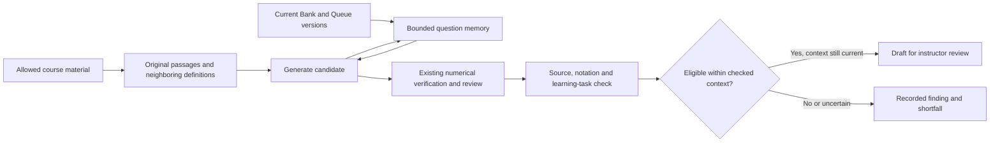

# Generation Quality and Observability Implementation Status

**Date:** 2026-10-05

**Delivery:** Local implementation of model usage visibility, Admin workflow inspection, an opt-in source-grounding/question-memory pilot, and offline teacher-review evaluation tools. This does not complete every requirement of the [implementation plan](IMPLEMENTATION-PLAN.md). Legacy and default generation retain the baseline policy.

## Local acceptance walkthrough (2026-10-05)

The screenshot report at `artifacts/generation-quality-local-2026-10-05/index.html`
shows the production application rather than the independent blinded-review demo.
Its screenshots are embedded, and its issue matrix distinguishes verified behavior
from mechanisms whose business benefit has not been measured.

- A real local SAML/Admin generation request reached the configured provider,
  which returned HTTP 429 with no remaining credits. No generated question
  succeeded. The failed call was recorded with unknown token counters; further
  paid generation was stopped. Successful streaming usage and semantic quality
  remain unverified.
- A deliberately stale Qdrant chunk was rejected by the pilot before any model
  call. The valid synthetic source index was restored after the check.
- A direct production-service check loaded two real local Bank/Queue versions
  and withheld an exact duplicate without calling the model. This does not
  establish semantic paraphrase detection or quality of newly generated output.
- A real local Instructor could read course-run usage (200), but could not read
  the Admin ledger (403). An unauthenticated usage request returned 401. The
  temporary Instructor course grant was removed after testing.
- The existing TA View scroll fix was checked with a manually authored long
  question at desktop, laptop and narrow viewport sizes. Desktop wheel input
  moved the reader from 0 to 814 pixels, and the final explanation was visible.
  Reloading still returned selection to the first row; this does not establish
  queue reordering. The role view used the local Admin test account.
- Production build and six focused Jest suites passed (97 tests). Controlled
  model responses in unit tests are not live-provider quality evidence.

Only authored synthetic sources and questions were used. File upload/parsing,
regeneration, hard-question quality and a real baseline/pilot quality comparison
were not exercised successfully. The synthetic local course is retained for
inspection; no live teaching records or account-wide settings were changed.

## What colleagues can use

| Audience | Location | Available information |
| --- | --- | --- |
| Course Instructor | Generation workbench, run usage details | Input/output/total tokens, coverage, stage/model subtotals, and individual model calls. Refresh reloads persisted data. |
| Course Instructor | Generation workbench, quality pilot and run details | Opt-in source and question-memory checks; source/notation/novelty findings; withheld-output shortfalls and diagnostic candidate content. |
| Admin | Operations → Model usage | Calls across users and courses, with user/course/date/request/run filters; actual model where reported, duration, outcome, JSON/content attempts, and nullable token counts. |
| Admin | Operations → User operations / Background tasks | Usage and individual calls associated with the selected request or content run. |
| Admin | Operations → Workflow timeline | Recorded API operations and content runs, upload filenames from existing metadata, outcomes, direct request/run associations, and explicitly inferred activity groups. Choose a user or course first. |

The new usage endpoints are Instructor/Admin or Admin-only. Instructor rows omit actor identity, request correlation, and internal tracking-session IDs. This change does not grant TA or Student usage access.

The timeline describes observable operations such as uploading a file, requesting generation, reading the queue, and saving a question. A successful enqueue request and its background task outcome appear separately. A 30-minute gap groups activity for inspection; timing does not prove a causal sequence. Pure browser interactions without recorded API activity are not visible.

## Implementation

- The LLM component emits one start/finish observation for each supported facade invocation. JSON correction and content retry attempts receive separate call IDs. An isolated OpenAI-compatible adapter requests the terminal streaming usage packet that toolkit 0.3.0 discards. The existing SDK retry policy is retained.
- `modelCallReceipts` stores safe call metadata and provider-reported counters. `modelUsageSessions` stores expected call IDs and closure information so missing receipts cannot silently become zero usage. Duplicate finalization does not add counts again.
- HTTP operation context supplies user/request/course identity. Agenda workers establish their own persisted run scope for generation, material analysis, course structure, and private assessment generation. Concurrent calls use AsyncLocalStorage context rather than a global current user/run.
- Summaries expose `complete`, `partial`, `pending`, and `unavailable`. A tracked zero-call session can report zero; older untracked activity cannot. Known counters on failed or discarded calls remain part of the subtotal.
- Failed telemetry writes do not retry model requests or fail successful authoring. Bounded process-local recording health and persisted coverage manifests expose detectable gaps. Late completions update existing receipts without reopening terminal runs.
- Admin receives an explicit usage DTO alongside the existing redacted diagnostics. General diagnostic credential/token redaction is preserved. The ledger does not store prompts, response bodies, source contents, credentials, or hidden reasoning text.
- The prompt A/B harness now aggregates observed calls, failed/error rows, JSON repair, and blueprint/preparation attempts with nullable counters. [The evaluation protocol](../../../scripts/prompt-ab/quality-protocol.md) defines teacher labels and denominators; no teacher judgments or quality improvements have been invented.

See [the API contract](../../api-contract.md#llm-usage-and-operation-derived-workflows-2026-10-03) and [the LLM component guide](../../../server/src/components/genai/llm/AGENTS.md) for endpoints and the provider support matrix.

## Observability verification

- Full Jest suite: **136 suites, 1,729 tests passed** with the unit network guard enabled.
- After strengthening redirect protection: network guard, LaTeX regression, and harness suites passed **33 tests**.
- After the final course-deletion race fix: accounting, coverage, and deletion suites passed **26 tests**.
- TypeScript server/client checks and production build passed.
- Repository-wide lint remains blocked by 115 errors in existing prototype JavaScript and unrelated Canvas local scripts. No errors were reported in the implementation's server/client source, tests, or prompt harness.
- Generation workbench browser suite passed **18 tests**; final usage-specific rerun passed **2 tests**.
- New Admin usage/workflow browser cases passed **4 tests**, including request/run details, filtering, empty/unknown counts, refresh behavior, and mobile rendering. New usage surfaces passed their accessibility checks.
- The existing full Admin Operations browser suite passed **11 of 12 tests**. The remaining navigation-order assertion expects the older menu; the workspace's separately developed Canvas navigation changes that order. This implementation does not alter that unrelated navigation.

During an initial full test run, the new provider adapter bypassed one old toolkit mock and unintentionally reached the configured API, which returned HTTP 429 without a generation result. Both facade-mock suites now use explicit synthetic provider configuration. Jest setup also rejects external `fetch`, Node HTTP, and HTTPS calls before dispatch, and prevents native-fetch redirects from a loopback fixture to an external endpoint. Loopback remains available for Supertest. The successful full run used this guard; no paid quality experiment was run.

## Coverage limits and deviations from the plan

- Counts cover instrumented LLM calls, not embeddings, parsing, infrastructure, currency pricing, or a complete provider bill. SDK-internal physical retries are not exposed and remain labeled unknown. No additional completion is made to recover missing usage.
- OpenAI-compatible terminal usage is covered by transport fixtures. A live-provider acceptance run has not been performed. Other providers expose only counters preserved by their current toolkit path; interrupted streams or unsupported fields can remain null.
- No historical token backfill is possible from the existing request audit. A process crash before any manifest/receipt write, or a complete write outage followed by process loss, cannot be reconstructed exactly. Completeness describes the recorded observation scope, not proof that every possible operation was captured.
- Usage refresh uses bounded polling and authoritative reads. A usage-specific SSE revision and batch usage endpoint remain unimplemented. Changing telemetry does not reopen a completed run.
- Permanent course deletion purges sessions before receipts; finalization never upserts deleted records. After course-scoped initialization fails, the tracker does not retry creating a session during later calls or close, preventing that recovery path from recreating deleted metadata. Its recording fault remains visible while the process lives. A full shared course write fence for all first authoring and telemetry starts remains part of recovery work. This slice does not claim exactly-once external billing or a general concurrency guarantee.
- Durable candidate/slot replay, question-version-specific regeneration attribution, and the complete teacher-labeled fixture set remain planned. Public generation runs now preserve the opt-in quality policy; current receipts preserve the effective safe settings of each observed call. Model option snapshots still follow the existing execution-time settings behavior.
- The timeline is bounded to 1,000 request records and 500 content runs per query and reports truncation. It is an inspection aid built from existing records, not a browser session recorder. Private assessment calls are visible in usage; their separate job collection is not represented as a content-run timeline row.

## Source and question-memory pilot

Select **Sources and question memory pilot** in the generation workbench before submitting a single request or batch. `grounded-memory-v1` is frozen on each run, inherited by saved recipes, and preserved by retry. Baseline is the default and remains available for comparison. The pilot requires the existing Reviewer feature to be enabled; it does not silently override an Admin setting. Side-by-side regeneration and private assessment generation retain their current policies in this slice.

**Source mechanism:** Qdrant locates relevant chunks, but only matching original Mongo source text becomes evidence. The packet adds immediate neighbors, records exact offsets and content-linked passage IDs, and hashes all scoped source chunks and metadata. Material revisions and ingest identity are retained. A stale vector payload, missing source chunks, cross-course material, changed source, or deleted source prevents the pilot from saving a candidate on that evidence. Necessary premises, correct reasoning, and misconception corrections are assessed against the frozen originals. Exact citation/quote validation checks the location of evidence; the model still judges whether it supports the claim. False options and false T/F claims remain valid question forms.

**Memory mechanism:** current versions from every active Bank/Queue state with overlapping LOs are read together. The generator sees bounded existing-question context plus prior same-batch candidates. Exact normalized duplicates can be withheld without an additional model call. Number/parameter similarity is only a possible-variant hint; a structured judgment compares the required inference, solution path, and misconception. Previously saved candidates are included in the next comparison. A changed Bank snapshot during the check causes a visible shortfall instead of silently trusting the old result.

**Decision and audit:** the pilot adds one structured quality check per non-exact-duplicate candidate, with only the existing JSON-format repair retry. Supported source reasoning, consistent notation, and an independent learning task are required for pilot eligibility. Other outcomes are withheld and recorded; they do not count as created Drafts. This does not declare teacher acceptance or override the normal reviewer, numerical serving gate, or Instructor approval. A bounded candidate copy, its content hash, source snapshot, compared version IDs, validated citations, and reasons remain in the run for inspection. Truncated diagnostic copies are labeled. They are authoring evidence, separate from the metadata-only token ledger. Extra model attempts appear under the `quality-review` usage stage, including failed and withheld work.

**Bounds:** at most 100 scoped materials, 2,000 indexed chunks and 1,000,000 source characters are hashed; larger scopes need a narrower selection. The model sees at most 30 passages and 30,000 source characters from retrieved chunks and immediate neighbors. Full source hashing does not mean full semantic source coverage. Memory reads at most 200 heads and shows a bounded ranked selection (normally 12 entries within 12,000 characters). Omitted questions, shortened excerpts, missing versions, and damaged source text are explicit coverage limits. Lexical retrieval is an initial heuristic; no semantic embedding index or cached pedagogical fingerprint store has been added.

**Concurrency and evaluation:** source and Bank rechecks are best effort, not a serialized commit fence. Another writer can still change context after the final read; concurrent batches do not have a global uniqueness guarantee. The pilot deliberately reports bounded-context findings. [OpenAI's evaluation guidance](https://developers.openai.com/api/docs/guides/evaluation-best-practices#llm-as-a-judge-and-model-graders) likewise recommends validating model judgments against human labels. The synthetic fixture set exercises the contracts and failure paths; it cannot establish a measured reduction in real teacher-reported errors.

**Verification:** the full Jest run passed **141 suites and 1,850 tests** with external model requests blocked. The subsequently added diagnostic snapshot suite passed **9 tests**; the final focused evidence/quality/diagnostic run passed **52 tests**. The workbench browser suite passed **23 tests** with API interception, including policy submission, immutable retry/reload behavior, legacy baseline behavior, withheld candidates, and diagnostic math rendering. Scoped desktop/mobile dark-mode accessibility checks passed, with no horizontal overflow. Server/client TypeScript checks, the production build, scoped ESLint across server/client source, tests and the prompt harness, and `git diff --check` passed. The existing unrelated repository-wide lint failures listed above remain outside this slice.

The fixture suite contains 10 authored synthetic finance cases and 12 candidates, with `labels: null`. Deterministic expectations cover missing/irrelevant source support, notation differences, numeric variants, similar-wording independent inference, Queue duplicates, thin-topic shortfalls, and correcting false statements. They are not teacher labels or results of a paid comparison. No live-provider generation or paid quality experiment was run for this pilot implementation.

## Next evaluation step

The [offline evaluation workflow](../../../scripts/prompt-ab/evaluation/README.md)
is now implemented. Terminal run details offer **Download evaluation export**
to Course Instructors/Admins. The export preserves exact initial generated
versions and recorded withheld candidates, original copied excerpts/frozen
evidence when available, historical numerical proofs, and usage. Missing original
versions become explicit unavailable slots; edited current versions and run preview
text are never substituted. Exports are retrospective and make no pre-run
Bank/Queue or model-option snapshot claim.

The local CLI imports these exports, creates a self-contained blinded review
page, validates completed review JSON against a separate private dataset/content
key, and writes JSON/Markdown reports. Reports retain all planned repetitions and
requested independent slots, including entire missing arms. Teacher acceptance,
variants, unresolved labels, all-slot versus saved-output issues, triage time,
nullable tokens, and source/notation/novelty judge confusion are separate.
Paired deltas require matching declared pre-run context/control hashes and
isolation; historical imports remain excluded. Hashes check supplied records,
not historical execution. Formal judge confusion also excludes retrospective,
unrecorded, or incomplete generation contexts; historical decisions cannot be
called judge errors against newly supplied evidence. Run/slot-specific caveats
remain in both JSON and Markdown reports. The CLI makes no model or database calls.

An unlabeled synthetic walkthrough exercises the complete import/review/report
flow without claiming model improvement. The full Jest suite passed **148 suites,
1,975 tests** with the network guard enabled. After adding review-bundle size
limits, the review suite passed **22 tests**, including the two new boundary
cases. The existing generation workbench browser suite passed **23 tests** with
the terminal export link, and the new standalone review browser suite passed
**4 tests**, including import/export, stale/conflicting records, triage, malicious
literal text, reviewer identity, and desktop/mobile accessibility. TypeScript,
production build, scoped ESLint, and diff checks passed. No live course exports,
paid generation, or real teacher labels were used in this verification.
The final matched-context calibration correction and run/slot caveat propagation
passed **6 focused suites / 124 tests**; the metrics suite now includes 34 tests.
The standalone CLI also passed its TypeScript check and regenerated an unlabeled
walkthrough with the final reporting rules.

A prospective A/B execution/capture runner and actual teacher-labeled measurements
remain work to do; this slice supplies the review and reporting tools, not
fabricated results.

1. Select representative finance LOs and freeze their source material and starting question bank. Collect teacher labels using the protocol, including out-of-scope reasoning and repeated learning tasks.
2. Capture a baseline with the now-visible attempts and usage. Measure accepted independent questions, review time, source-scope errors, duplication, latency, and recorded tokens; retain missing-usage coverage alongside every cost comparison.
3. Compare baseline and the pilot on the same frozen sources and starting Bank. Randomize teacher review order and include every withheld/failed candidate in supply, review-time, and usage metrics. Calibrate the novelty/source judge before broad rollout; then decide whether evidence retrieval, memory ranking, or bounded repair has the largest remaining benefit.

All documentation, code comments, and product text added by this implementation are English. Changes remain local and uncommitted; no deployment or push is included in this delivery.
